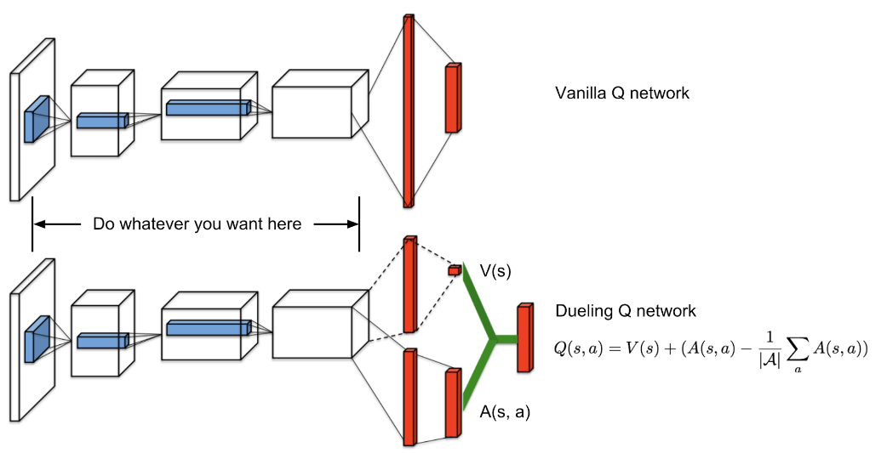

# DOOM Environment Reinforcement Learning 


This project consists of a implementation of how to solve the Doom environment using Reinforcement learning methods named Deep Q Learning and Dueling Deep Q Learning  .

Dueling Deep Q Model




## Installation

Use the package manager [pip](https://pip.pypa.io/en/stable/) to install below packages for Linux .

```bash
sudo apt-get install build-essential zlib1g-dev libsdl2-dev libjpeg-dev \
nasm tar libbz2-dev libgtk2.0-dev cmake git libfluidsynth-dev libgme-dev \
libopenal-dev timidity libwildmidi-dev unzip

sudo apt-get install libboost-all-dev
pip install opencv
sudo apt-get install liblua5.1-dev
```

## Usage

```python
1. doom-rl.ipynb -- Deep Q Model
2. doom-ddq-prior_replay.ipynb -- Dueling Deep Q Model
```


go through above notebook to understand how we use solve doom environment . 

## Results

* Results from solved environment [video file](support/results.mp4) .

## Contributing
Pull requests are welcome. For major changes, please open an issue first to discuss what you would like to change.

Please make sure to update tests as appropriate.

## License
Apache License 2.0